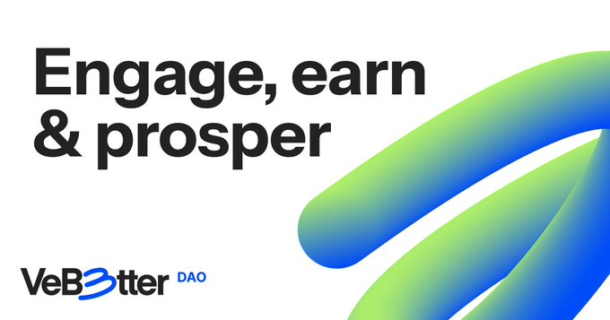

# VeBetter

<figure><figcaption></figcaption></figure>

VeBetter is a decentralized autonomous organization (DAO) platform built on [VechainThor](https://www.vechain.org/vechainthor/) that empowers its community through a suite of smart contracts designed for governance, incentive distribution, and asset management. The key components of the platform include:

1. **B3TR Token**: The incentive ERC-20 token with a 1 billion cap, used within the ecosystem for rewards and governance.
2. **Governance System**:
   * **B3TRGovernor**: Facilitates decentralized governance where any community member can create proposals. Proposals require a deposit of `VOT3` tokens to become active, and successful proposals are executed via the `TimeLock` contract.
   * **TimeLock**: Ensures a time delay in the execution of governance decisions for security and transparency.
3. **Incentive Mechanisms**:
   * **Emissions**: Manages the periodic distribution of `B3TR` tokens to various allocations including `XAllocation`, `Vote2Earn`, and Treasury.
   * **VoterRewards**: Rewards voters based on their voting power and `Galaxy Member` NFT level.
   * **X2Earn Apps and Rewards**: Supports x-2-earn applications by managing the insertion, management, and eligibility of apps for `B3TR` allocation rounds. Rewards users for sustainable actions within these apps through the `X2EarnRewardsPool`.
4. **User Privileges and Rewards**:
   * **GalaxyMember**: An upgradeable NFT system that determines user privileges and `B3TR` token rewards based on the NFT level.
5. **Asset Management**:
   * **Treasury**: Holds all DAO assets, including various ERC-20 and ERC-721 tokens. Asset transfers are governed by community proposals.
6. **Voting and Allocation**:
   * **XAllocationPool**: Distributes weekly `B3TR` emissions for x2earn apps.
   * **XAllocationVoting**: Manages voting for x2Earn application support, using a "Quadratic Funding" formula to calculate voting power based on `VOT3` holdings.

VeBetter leverages these contracts to create a robust and democratic ecosystem where community members can actively participate in governance, earn rewards, and contribute to the platform's growth.

### Resources

You can find the smart contracts repository at this [GitHub url.](https://github.com/vechain/vebetterdao-contracts) Use that repo to generate ABIs and Typechain Types to interact with the contracts.

Read more about our smart contracts and what they do in the [Smart Contracts](vebetter/smart-contracts.md) section.

### Contracts addresses

Contracts have been deployed on the vechain mainnet at the following addresses.

<table><thead><tr><th width="252">Contract</th><th>Address</th></tr></thead><tbody><tr><td>B3TR</td><td>0x5ef79995FE8a89e0812330E4378eB2660ceDe699</td></tr><tr><td>B3TRGovernor</td><td>0x1c65C25fABe2fc1bCb82f253fA0C916a322f777C</td></tr><tr><td>Emissions</td><td>0xDf94739bd169C84fe6478D8420Bb807F1f47b135</td></tr><tr><td>GalaxyMember</td><td>0x93B8cD34A7Fc4f53271b9011161F7A2B5fEA9D1F</td></tr><tr><td>TimeLock</td><td>0x7B7EaF620d88E38782c6491D7Ce0B8D8cF3227e4</td></tr><tr><td>Treasury</td><td>0xD5903BCc66e439c753e525F8AF2FeC7be2429593</td></tr><tr><td>VOT3</td><td>0x76Ca782B59C74d088C7D2Cce2f211BC00836c602</td></tr><tr><td>VoterRewards</td><td>0x838A33AF756a6366f93e201423E1425f67eC0Fa7</td></tr><tr><td>X2EarnApps</td><td>0x8392B7CCc763dB03b47afcD8E8f5e24F9cf0554D</td></tr><tr><td>X2EarnRewardsPool</td><td>0x6Bee7DDab6c99d5B2Af0554EaEA484CE18F52631</td></tr><tr><td>XAllocationPool</td><td>0x4191776F05f4bE4848d3f4d587345078B439C7d3</td></tr><tr><td>XAllocationVoting</td><td>0x89A00Bb0947a30FF95BEeF77a66AEdE3842Fe5B7</td></tr><tr><td>VeBetter Passport</td><td>0x35a267671d8EDD607B2056A9a13E7ba7CF53c8b3</td></tr><tr><td>X2EarnCreator</td><td>0xe8e96a768ffd00417d4bd985bec9EcfC6F732a7f</td></tr><tr><td>NodeManagement</td><td>0xB0EF9D89C6b49CbA6BBF86Bf2FDf0Eee4968c6AB</td></tr><tr><td>GrantsManager</td><td>0x055d20914657834c914d7c44bf65b566ab4b45a2</td></tr><tr><td>Dynamic Base Allocations Pool</td><td>0x98c1d097c39969bb5de754266f60d22bd105b368</td></tr><tr><td>Relayers Rewards Pool (Auto-voting)</td><td>0x34b56f892c9e977b9ba2e43ba64c27d368ab3c86</td></tr></tbody></table>

