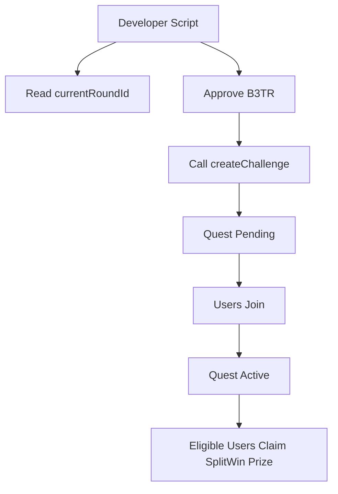

# Create B3MO Quests from Contract

This guide shows how to create a B3MO Quest directly through the `B3TRChallenges` contract, without using the VeBetterDAO platform UI.

The walkthrough creates a **Sponsored Public Split Win** quest:

* the creator funds the full prize pool
* anyone can join while the quest is pending
* the first `numWinners` participants that reach `threshold` actions can claim a fixed prize


In the contracts, B3MO Quests are still named "challenges". You will see names such as `B3TRChallenges`, `createChallenge`, and `challengeId` in the ABI.


## Requirements

You need:

* B3TR in the creator wallet
* VTHO in the creator wallet to pay gas
* the `B3TR`, `B3TRChallenges`, and `XAllocationVoting` contract addresses for your network
* a future allocation round for `startRound`
* optional X2Earn app IDs if you want to count actions only from specific apps

Install the packages:

```shell
yarn add @vechain/sdk-core @vechain/sdk-network ethers
```

## Contract Addresses

| Network | Node URL | B3TR | B3TRChallenges | XAllocationVoting |
| ------- | -------- | ---- | --------------- | ----------------- |
| Testnet | `https://testnet.vechain.org` | `0x3d920eab29134c23c4477686749608391a635587` | `0x4a6bc52a7eecac26a13e284b75266c0c40cbde91` | `0x8770a4659e42b7b4d7ac7fcaa27ef21b209372de` |
| Mainnet | `https://mainnet.vechain.org` | `0x5ef79995FE8a89e0812330E4378eB2660ceDe699` | `0x92a98f23ca4f9703781cf56088b76a1482667166` | `0x89A00Bb0947a30FF95BEeF77a66AEdE3842Fe5B7` |

## Flow



## Create a Sponsored Public Split Win Quest

Set the environment variables:

```shell
NODE_URL=https://testnet.vechain.org
PRIVATE_KEY=your_private_key_without_0x
CREATOR_ADDRESS=0xyour_wallet_address
B3TR_ADDRESS=0x3d920eab29134c23c4477686749608391a635587
B3TR_CHALLENGES_ADDRESS=0x4a6bc52a7eecac26a13e284b75266c0c40cbde91
X_ALLOCATION_VOTING_ADDRESS=0x8770a4659e42b7b4d7ac7fcaa27ef21b209372de
```

Then run:

```typescript
import {
  ABIContract,
  Address,
  Clause,
  HexUInt,
  Transaction,
  type TransactionClause,
} from "@vechain/sdk-core";
import {
  ProviderInternalBaseWallet,
  signerUtils,
  ThorClient,
  VeChainProvider,
} from "@vechain/sdk-network";
import { parseEther } from "ethers";

const ChallengeKind = { Stake: 0, Sponsored: 1 } as const;
const ChallengeVisibility = { Public: 0, Private: 1 } as const;
const ChallengeType = { MaxActions: 0, SplitWin: 1 } as const;

const b3trAbi = [
  {
    type: "function",
    name: "approve",
    stateMutability: "nonpayable",
    inputs: [
      { name: "spender", type: "address" },
      { name: "amount", type: "uint256" },
    ],
    outputs: [{ name: "", type: "bool" }],
  },
] as const;

const xAllocationVotingAbi = [
  {
    type: "function",
    name: "currentRoundId",
    stateMutability: "view",
    inputs: [],
    outputs: [{ name: "", type: "uint256" }],
  },
] as const;

const challengesAbi = [
  {
    type: "function",
    name: "createChallenge",
    stateMutability: "nonpayable",
    inputs: [
      {
        name: "params",
        type: "tuple",
        components: [
          { name: "kind", type: "uint8" },
          { name: "visibility", type: "uint8" },
          { name: "challengeType", type: "uint8" },
          { name: "stakeAmount", type: "uint256" },
          { name: "startRound", type: "uint256" },
          { name: "endRound", type: "uint256" },
          { name: "threshold", type: "uint256" },
          { name: "numWinners", type: "uint256" },
          { name: "appIds", type: "bytes32[]" },
          { name: "invitees", type: "address[]" },
          { name: "title", type: "string" },
          { name: "description", type: "string" },
          { name: "imageURI", type: "string" },
          { name: "metadataURI", type: "string" },
        ],
      },
    ],
    outputs: [{ name: "", type: "uint256" }],
  },
] as const;

const required = (name: string) => {
  const value = process.env[name];
  if (!value) throw new Error(`Missing ${name}`);
  return value;
};

async function main() {
  const thor = ThorClient.at(required("NODE_URL"));
  const creatorAddress = required("CREATOR_ADDRESS");

  const provider = new VeChainProvider(
    thor,
    new ProviderInternalBaseWallet([
      {
        privateKey: HexUInt.of(required("PRIVATE_KEY").replace(/^0x/, "")).bytes,
        address: creatorAddress,
      },
    ]),
    false,
  );

  const voting = thor.contracts.load(
    required("X_ALLOCATION_VOTING_ADDRESS"),
    xAllocationVotingAbi,
  );
  const [currentRound] = await voting.read.currentRoundId();

  const stakeAmount = parseEther("1000");
  const startRound = currentRound + 1n;
  const endRound = startRound + 1n;

  const params = {
    kind: ChallengeKind.Sponsored,
    visibility: ChallengeVisibility.Public,
    challengeType: ChallengeType.SplitWin,
    stakeAmount,
    startRound,
    endRound,
    threshold: 10n,
    numWinners: 5n,
    appIds: [],
    invitees: [],
    title: "Recycle 10 items",
    description: "First 5 participants with 10 tracked actions win.",
    imageURI: "",
    metadataURI: "",
  };

  const approveClause = Clause.callFunction(
    Address.of(required("B3TR_ADDRESS")),
    ABIContract.ofAbi(b3trAbi).getFunction("approve"),
    [required("B3TR_CHALLENGES_ADDRESS"), stakeAmount],
  ) as TransactionClause;

  const createQuestClause = Clause.callFunction(
    Address.of(required("B3TR_CHALLENGES_ADDRESS")),
    ABIContract.ofAbi(challengesAbi).getFunction("createChallenge"),
    [params],
  ) as TransactionClause;

  const clauses = [approveClause, createQuestClause];
  const gas = await thor.transactions.estimateGas(clauses, creatorAddress);
  const txBody = await thor.transactions.buildTransactionBody(
    clauses,
    gas.totalGas,
  );

  const signer = await provider.getSigner(creatorAddress);
  const rawSignedTx = await signer.signTransaction(
    signerUtils.transactionBodyToTransactionRequestInput(txBody, creatorAddress),
  );

  const signedTx = Transaction.decode(
    HexUInt.of(rawSignedTx.slice(2)).bytes,
    true,
  );

  const sent = await thor.transactions.sendTransaction(signedTx);
  const receipt = await sent.wait();

  console.log(`Transaction: ${sent.id}`);
  console.log(`Reverted: ${receipt?.reverted}`);
}

main().catch(error => {
  console.error(error);
  process.exit(1);
});
```

The transaction has two clauses:

1. `B3TR.approve(B3TRChallenges, stakeAmount)`
2. `B3TRChallenges.createChallenge(params)`

If the second clause reverts, the whole transaction reverts and the approval is not applied.

## Parameters

| Field | Sponsored Public Split Win value |
| ----- | -------------------------------- |
| `kind` | `1` (`Sponsored`) |
| `visibility` | `0` (`Public`) |
| `challengeType` | `1` (`SplitWin`) |
| `stakeAmount` | Total B3TR prize pool, in wei |
| `startRound` | A future allocation round. Use `currentRoundId() + 1` for the next round |
| `endRound` | Last round where actions count |
| `threshold` | Minimum action count required to claim a Split Win slot |
| `numWinners` | Number of prize slots |
| `appIds` | Empty array for all apps, or selected X2Earn app IDs |
| `invitees` | Empty array for public quests |
| `title` | Max 120 bytes |
| `description` | Max 500 bytes |
| `imageURI` | Optional, max 512 bytes |
| `metadataURI` | Optional, max 512 bytes |

For Split Win, `stakeAmount / numWinners` is fixed when the quest is created. The contract requires at least `1 B3TR` per winner.

## Valid Quest Combinations

| Kind | Visibility | Type | Required fields |
| ---- | ---------- | ---- | --------------- |
| `Sponsored` | `Public` | `SplitWin` | `threshold > 0`, `numWinners > 0`, no invitees required |
| `Sponsored` | `Private` | `MaxActions` | `threshold = 0`, `numWinners = 0`, invitees optional |
| `Sponsored` | `Private` | `SplitWin` | `threshold > 0`, `numWinners > 0`, invitees optional |
| `Stake` | `Private` | `MaxActions` | `threshold = 0`, `numWinners = 0`, participants must approve and stake when joining |

Public Stake quests, public MaxActions quests, and Stake SplitWin quests are invalid.

## Lifecycle

* `Pending`: users can join. The creator can cancel before `startRound`.
* `Active`: the quest has started and actions are counted through VeBetterPassport.
* `Completed`: rewards or refunds can be claimed.
* `Cancelled`: creator cancelled before the quest started.
* `Invalid`: the quest did not meet its activation rules.

Split Win quests do not use `completeChallenge`. Winners call `claimSplitWinPrize` while the quest is active. After `endRound`, the creator can call `claimCreatorSplitWinRefund` to reclaim unclaimed slots.

MaxActions quests are different: once the quest has ended, a participant or creator calls `completeChallenge`, then winners call `claimChallengePayout`.

## Common Errors

| Error | Meaning |
| ----- | ------- |
| `InvalidAmount` | `stakeAmount` is zero |
| `BetAmountBelowMinimum` | `stakeAmount` is below `minBetAmount()` |
| `InvalidStartRound` | `startRound` is not in the future |
| `InvalidEndRound` | `endRound` is before `startRound` |
| `InvalidChallengeTypeForCombo` | The selected kind, visibility, and type combination is not allowed |
| `InvalidTypeConfiguration` | `threshold` or `numWinners` does not match the selected type |
| `InsufficientPrizePerWinner` | Split Win prize per winner is below `1 B3TR` |
| `ChallengeUnknownApp` | One of the selected `appIds` does not exist in `X2EarnApps` |
| `MaxChallengeDurationExceeded` | The round range is longer than `maxChallengeDuration()` |
| `MaxSelectedAppsExceeded` | Too many selected app IDs |

Use `maxChallengeDuration()`, `maxSelectedApps()`, `maxParticipants()`, and `minBetAmount()` on `B3TRChallenges` to read the current limits before building your form or script.
