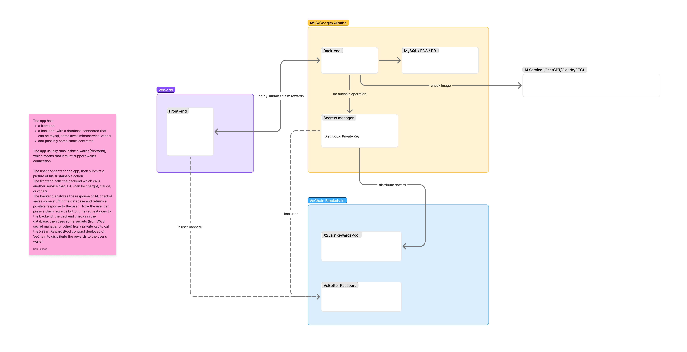

# Get Started

## Requirements

If you want to create an x2earn app it needs to have the following features:

* Be able to **distribute B3TR** tokens on the VeChain blockchain
* Be able to **submit a proof** (in JSON format) of the sustainable action the user was rewarded for

Bonus:

* Allow the user to **connect** with their [wallet](https://vechain-kit.vechain.org/)  to your app

This guide provides instructions for setting up a project within the VeBetter ecosystem. Your app will participate in weekly allocation  rounds, receive B3TR tokens at the beginning of each round, and distribute these

<figure><figcaption>
Architecture overview of components that could be involved in creating a x2earn app
</figcaption></figure>

## Test Environment

Use our [Test Environment](https://staging.testnet.governance.vebetterdao.org/) to create a test app running **in the VeBetter ecosystem.**


[test-environment.md](test-environment.md)


## **Distribute B3TR**&#x20;

Get some B3TR tokens on testnet, add a reward distributor then connect a smart contract or a backend and distribute rewards to your users.


[testnet-b3tr-tokens.md](testnet-b3tr-tokens.md)



[reward-distribution](reward-distribution/)


## Proofs and Impacts

Every time you reward a user you also need to specify the reason, the proof of the user's action and the sustainability impact it had.


[sustainability-proof-and-impacts.md](sustainability-proof-and-impacts.md)


## Resources

Have doubts? Check our additional resources specifically picked for you to speed up your development.


[resources.md](resources.md)


## Submit App

When your app is ready submit it to VeBetter and join the movement!


[submit-your-app.md](submit-your-app.md)


## RuleBook


[rulebook-for-apps.md](rulebook-for-apps.md)


## Security&#x20;


Before going live be sure to go through our [Security Considerations](security-considerations.md)  along the [RuleBook](rulebook-for-apps.md). Make sure to apply security measures to your app, avoiding hacks and farmers.&#x20;



[security-considerations.md](security-considerations.md)


