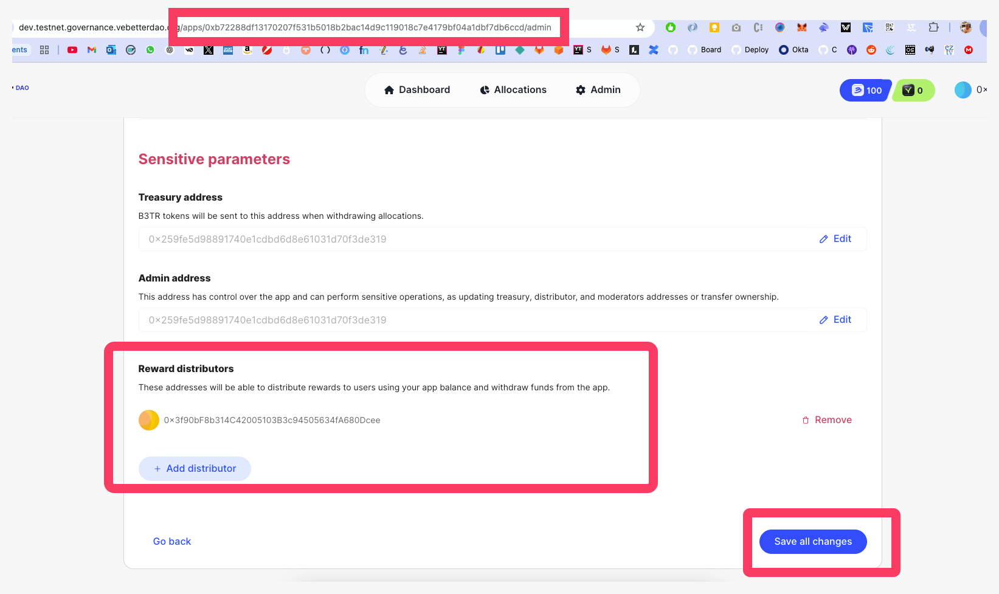

# JavaScript

Setup a lambda function or an endpoint that will send the B3TR tokens to the user, providing also a proof and impacts of the rewarding action.

We will use [@vechain/sdk-network](https://docs.vechain.org/developer-resources/sdks-and-providers/sdk) and [@vechain/vebetterdao-contracts](https://github.com/vechain/vebetterdao-contracts) to interact with VeBetter's `X2EarnRewardsPool` contract to distribute the rewards.

Run the following command to install the packages:

```shell
yarn add @vechain/sdk-network @vechain/vebetterdao-contracts
```

To distribute the rewards you will need 2 information:

* `Node URL`

```
TESTNET: https://testnet.vechain.org
MAINNET: https://mainnet.vechain.org
```

* Your `APP_ID` on VeBetter: create app [here](https://dev.testnet.governance.vebetterdao.org/) to obtain the APP\_ID.

Now you can distribute the reward like this:




```javascript
import {
  ProviderInternalHDWallet,
  ThorClient,
  VeChainProvider,
  VeChainSigner,
} from "@vechain/sdk-network";
import { X2EarnRewardsPool } from "@vechain/vebetterdao-contracts";

function rewardUser() {
    // To transfer B3TR we first need to connect to the blockchain with
    // a wallet capable of signing and broadcastisting transactions
    const thor = ThorClient.at(process.env.NODE_URL || "");
    const provider = new VeChainProvider(
      thor,
      new ProviderInternalHDWallet(
        process.env.REWARD_SENDER_MNEMONIC?.split(" ") || []
      )
    );
    const rootSigner = await provider.getSigner();

    // Call the VeBetterDAO smart contract
    const x2EarnRewardsPoolContract = thor.contracts.load(
      process.env.X2EARN_REWARDS_POOL_ADDRESS || "",
      X2EarnRewardsPool.abi,
      rootSigner as VeChainSigner
    );
    
    const tx =
      await x2EarnRewardsPoolContract.transact.distributeRewardDeprecated(
        process.env.VEBETTERDAO_APP_ID || "",
        10,
        address,
        JSON.stringify({
          version: 2,
          description: "User refilled water from a sustainable source",
          proof: {
            image: "https://image.png",
            link: "https://twitter.com/tweet/1",
          },
          impact: {
             carbon: 100,
             water: 200
          }
        })
      );

    await tx.wait();
}

```





```javascript
import {
  ProviderInternalHDWallet,
  ThorClient,
  VeChainProvider,
  VeChainSigner,
} from "@vechain/sdk-network";
import { X2EarnRewardsPool } from "@vechain/vebetterdao-contracts";

const PRIVATE_KEY = ""
const ACCOUNT_ADDRESS_OF_PK = ""

function rewardUser() {
    // To transfer B3TR we first need to connect to the blockchain with
    // a wallet capable of signing and broadcastisting transactions
    const thor = ThorClient.at(process.env.NODE_URL || "");
    const wallet = new ProviderInternalBaseWallet(
        [
            {
                privateKey: Buffer.from(
                    PRIVATE_KEY.slice(2),
                    'hex',
                ),
                address: ACCOUNT_ADDRESS_OF_PK,
            },
        ],
    );
    const provider = new VeChainProvider(
        thor,
        wallet,
        false,
    );
    const signer = await provider.getSigner(
        ACCOUNT_ADDRESS_OF_PK,
    );

    // Call the VeBetterDAO smart contract
    const x2EarnRewardsPoolContract = thor.contracts.load(
      process.env.X2EARN_REWARDS_POOL_ADDRESS || "",
      X2EarnRewardsPool.abi,
      rootSigner as VeChainSigner
    );
    
    const tx =
      await x2EarnRewardsPoolContract.transact.distributeRewardDeprecated(
        process.env.VEBETTERDAO_APP_ID || "",
        10,
        address,
        JSON.stringify({
          version: 2,
          description: "User refilled water from a sustainable source",
          proof: {
            image: "https://image.png",
            link: "https://twitter.com/tweet/1",
          },
          impact: {
             carbon: 100,
             water: 200
          }
        })
      );

    await tx.wait();
}

```




### Sustainability Proof

Read more about the proof standard and how we expect you to provide it in the [Sustainability Proofs and Impacts](../sustainability-proof-and-impacts.md) section.



To be able to distribute the rewards you will need to add the PUBLIC ADDRESS of the wallet calling the `distributeRewards` function as a Reward Distributor of your app. \
\
To do so, you need to:

1\) Connect with your app's admin wallet to the governance dapp

2\) Go to your app's page

3\) Click the _cogs_ button to enter the settings page

4\) Scroll down to the "Reward Distributors" section, and add the public address as a reward distributor

5\) Save changes


<figure><figcaption></figcaption></figure>
