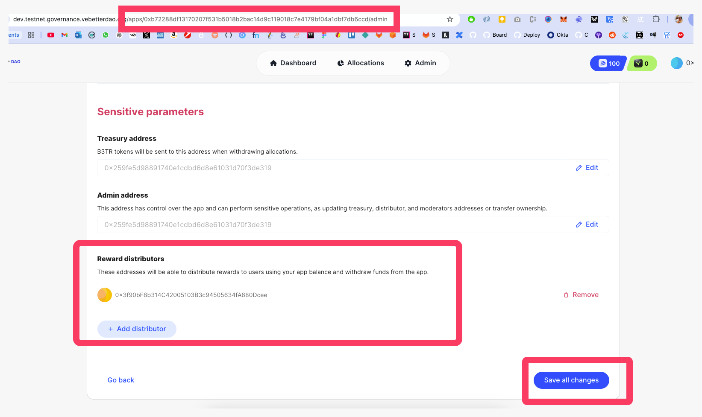

# Solidity

In this example, we assume that you are building a smart contract where users can submit some sustainable action that is being approved/rejected by some moderator. If the action is approved the user can claim his rewards. No backend is involved.

Your contract should look like this:

<pre class="language-solidity"><code class="lang-solidity"><strong>// SPDX-License-Identifier: MIT
</strong>pragma solidity 0.8.20;

// can find here: https://github.com/vechain/vebetterdao-contracts/tree/main/contracts/interfaces
import "./interfaces/IX2EarnRewardsPool.sol";

/**
 * Example contract with key functionality to interact with the x2Earn rewards pool
 * and distribute rewards.
 * You can customize this contract in the way 
 */
contract MySustainableAppContract {
    IX2EarnRewardsPool public x2EarnRewardsPool;
    bytes32 public VBD_APP_ID;
    
    // a dummy mapping pretending you have a way to track and 
    // validate user actions on chain.
    mapping(uint256 actionId => ActionStruct) public sustainableActions;
    mapping(uint256 actionId => bool) public rewardsClaimed;
    
    // You will need to setup the address of the X2EarnRewardsPool contract
    // and your APP_ID on VeBetterDAO
    constructor(IX2EarnRewardsPool _x2EarnRewardsPool, bytes32 _VBD_APP_ID) {
        x2EarnRewardsPool = _x2EarnRewardsPool;
        VBD_APP_ID = _VBD_APP_ID;
    }

    /**
     * @notice A function that allows a user to claim a reward for a specific
     * sustainable action that they performed.
     *
     * Since V9 the proof arrays are mandatory on distributeRewardWithProof —
     * empty arrays revert with "X2EarnRewardsPool: proof is mandatory".
     *
     * IMPORTANT: the address of this contract must be set as a distributor
     * of your APP in order to move funds from the X2EarnRewardsPool contract.
     * You can set this on the VeBetterDAO governance app.
     */
    function claimReward(uint256 _actionId) external {
        // ... some code to check if the action is valid and user can claim

        string[] memory proofTypes = new string;
        proofTypes[0] = "link";

        string[] memory proofValues = new string;
        proofValues[0] = actions[_actionId].proofUrl;

        string[] memory impactCodes = new string;
        impactCodes[0] = "waste_mass";

        uint256[] memory impactValues = new uint256;
        impactValues[0] = actions[_actionId].impact;

        // If distributeRewardWithProof fails, it will revert
        x2EarnRewardsPool.distributeRewardWithProof(
            VBD_APP_ID,
            actions[_actionId].rewardAmount,
            msg.sender, // this is the user calling the claimReward function
            proofTypes,
            proofValues,
            impactCodes,
            impactValues,
            "User performed a sustainable action on my app"
        );

        rewardClaimed[_actionId] = true;

        emit RewardClaimed(_actionId, msg.sender);
    }
}
</code></pre>

### Distributing a Bonus / Non-Sustainable Reward (V9+)

Use `distributeNonProofReward` for rewards that should **not** register a passport action — endorser payouts, leaderboard prizes, streak bonuses, cashback, referral payouts, etc. The contract emits `NonProofRewardDistributed` with a typed `NonProofRewardCategory` so indexers can exclude the payout from personhood signals.

<pre class="language-solidity"><code class="lang-solidity">    function payLeaderboardPrize(address winner, uint256 amount, uint8 place) external onlyAdmin {
        x2EarnRewardsPool.distributeNonProofReward(
            VBD_APP_ID,
            amount,
            winner,
            IX2EarnRewardsPool.NonProofRewardCategory.Leaderboard,
            string.concat("Week ", Strings.toString(currentWeek), " leaderboard - place ", Strings.toString(place))
        );
    }
</code></pre>

Available categories: `Endorser`, `Leaderboard`, `Streak`, `Cashback`, `Referral`, `Other`.

### Attributing Actions to a Specific Round

If your app allows users to accumulate actions and claim later, use `distributeRewardForRound` to attribute the action to the round it was performed in:

<pre class="language-solidity"><code class="lang-solidity">
    function claimReward(uint256 _actionId, uint256 _actionRound) external {
        // ... some code to check if the action is valid and user can claim

        // Attribute the action to the round it was performed in
        x2EarnRewardsPool.distributeRewardForRound(
            VBD_APP_ID,
            actions[_actionId].rewardAmount,
            msg.sender,
            "",
            _actionRound // the round when the action was actually performed
        );

        rewardClaimed[_actionId] = true;

        emit RewardClaimed(_actionId, msg.sender);
    }
</code></pre>


The address of this contract must be set as a **distributor** of your APP in order to move funds from the X2EarnRewardsPool contract.

You can set this on the VeBetter governance app.

.png>)



### Sustainability Proof

Read more about the proof standard and how we expect you to provide it in the [Sustainability Proofs and Impacts](../sustainability-proof-and-impacts.md) section.



To be able to distribute the rewards you will need to add the PUBLIC ADDRESS of the wallet calling the `distributeRewards` function as a Reward Distributor of your app. \
\
To do so, you need to:

1\) Connect with your app's admin wallet to the governance dapp

2\) Go to your app's page

3\) Click the _cogs_ button to enter the settings page

4\) Scroll down to the "Reward Distributors" section, and add the public address as a reward distributor

5\) Save changes


<figure><figcaption></figcaption></figure>
