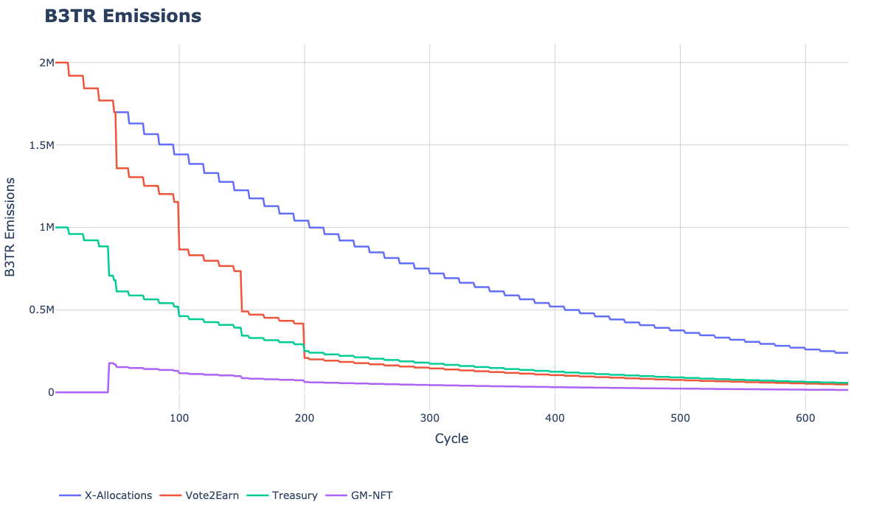

# B3TR Emissions

VeBetter distributes the B3TR token via a long-term emission schedule designed to incentivize sustainable behavior and community participation in governance. Emissions are distributed weekly and are split across several key allocation pools.

### Recent Governance Change (April 2025)

As a result of an approved governance proposal, the following updates were implemented:

* The Treasury allocation was reduced from 20% to 15% for each cycle starting from cycle 46.
* The remaining 5% was reallocated to a new GM Rewards Pool, exclusively for Galaxy Member (GM) NFT holders who actively participate in governance voting

These changes ensure more direct rewards for active and engaged members of the community.

## Emissions Schedule 

B3TR token has \~1 billion total supply, that will be emitted weekly over a period of 634 weeks or 12 years.

_N.B._ We will use the term **cycle** instead of **week** when referring to the emissions schedule.

| **Pool**      | **% of total supply** | **Initial emissions**                                                        | **Decay Rate**                                 |
| ------------- | --------------------- | ---------------------------------------------------------------------------- | ---------------------------------------------- |
| X-Allocations | 53%                   | 2,000,000                                                                    | 4% every 12 cycles​                            |
| Vote2earn     | 27%                   | Follows the X-Allocation emissions but with an additional decay rate applied | 20% of x-allocations emissions every 50 cycles |
| Treasury      | 16%                   | 25% of total allocation for X-Allocations and Vote2earn                      | No decay as pegged to the other emission       |
| GM Rewards    | 4%                    | 5% of weekly emissions, reallocated from the original 20% Treasury share     | No decay as pegged to the other emission       |

### Emissions Chart&#x20;

[🔗 Explore Interactive B3TR Emissions Simulator](https://b3tr-emissions.streamlit.app/)

<figure><figcaption></figcaption></figure>

## Emissions Parameters 

The Emissions smart contract contains parameters for the emissions scheduling.

| **Param**                          | **Value**                                                     | **Upgradeable** |
| ---------------------------------- | ------------------------------------------------------------- | --------------- |
| X-Allocations address              | `0x4191776F05f4bE4848d3f4d587345078B439C7d3`                  | Yes             |
| Vote2earn address                  | `0x838A33AF756a6366f93e201423E1425f67eC0Fa7`                  | Yes             |
| Treasury address                   | `0xD5903BCc66e439c753e525F8AF2FeC7be2429593`                  | Yes             |
| Total supply                       | 1B                                                            | No              |
| Emissions frequency (cycle length) | 1 week                                                        | Yes             |
| X-Allocations decay rate           | 4%                                                            | Yes             |
| X-Allocations decay frequency      | every 12 cycles                                               | Yes             |
| Vote2earn decay rate               | 20%                                                           | Yes             |
| Vote2earn decay frequency          | every 50 cycles                                               | Yes             |
| Treasury % allocation              | 15% of total emissions for the cycle _(updated via proposal)_ | Yes             |
| Gm Pool % Allocation               | 5% of total emissions for the cycle _(added via proposal)_    | Yes             |

## Triggering Emissions

Emissions need some sort of trigger, as it is not possible for a smart contract to invoke itself. There is a public function that can be triggered by any account. In addition to this, the foundation automatically triggers the emissions, if this operation fails, any other user can trigger it.

 
